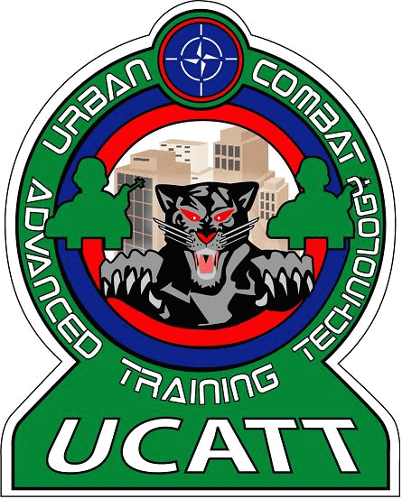

## Vision & Goals

Joint and combined military operations world-wide drives the requirements for live training. 

NATO envision a family of standards which will allow the use of live simulation systems from multiple vendors in one (distributed) training area, without imposing system design. 
Furthermore, integration with virtual and constructive simulation systems, and with C2 systems, using applicable standards, should be possible.

Requirements for a set of open international standards to allow live simulation systems to interoperate in a multinational training environment have been identified. A functional architecture that defines interfaces that need standardization to achieve this goal have been defined.

