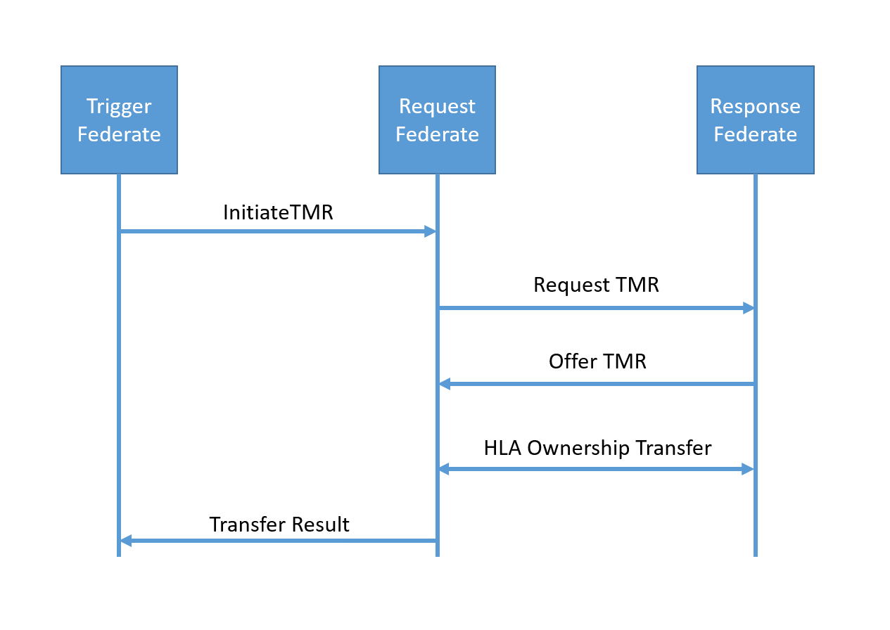

## NETN Transfer of Modelling Responsibility (TMR)

The NETN Transfer of Modelling Responsibility (TMR) component is used to control and manage the change of responsibility for modelling a set of attributes from one simulation to another. 

There are several reasons why a TMR can be a good solution in a federated simulation. Being able to dynamically select the most appropriate federate to model certain aspects of a simulated entity and to delegate the responsibility of updating corresponding attributes is a key feature of NETN based simulation.

For example TMR can be used change modelling responsibilities from Live or Recorded entities to Constructive or Virtual simulations. It can be used for dynamic load balancing, fault handling and hand-over, delegating modelling of e.g. damage assessment and movement, etc.

